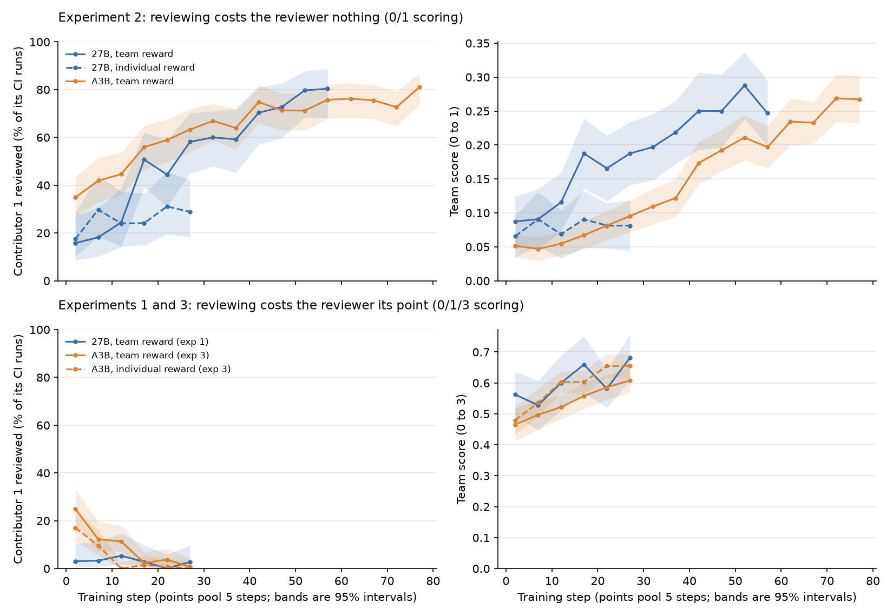
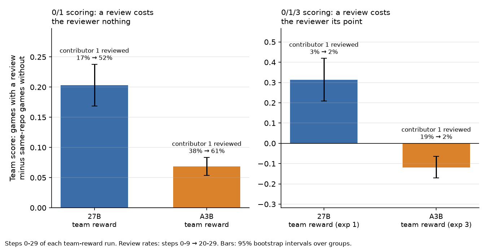
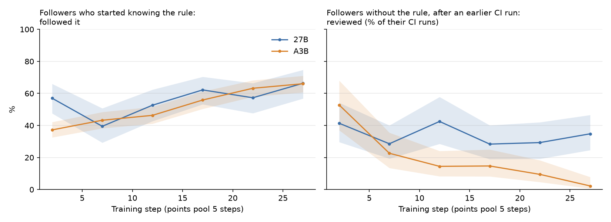
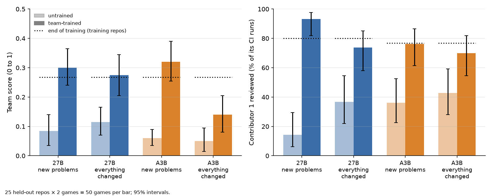
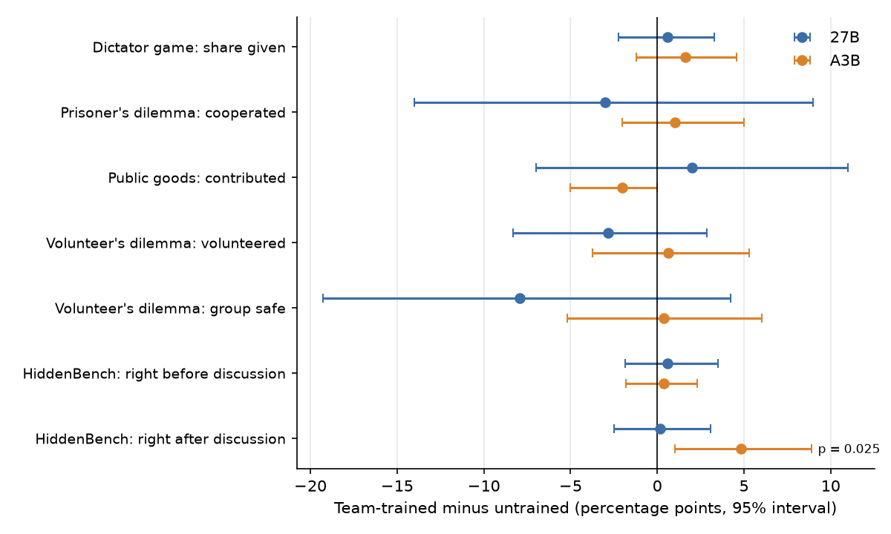

# Sacrifice relay: does RL teach agents to give up their own reward to help later agents?

**Status (2026-10-06): paused.** Three training experiments (2026-09-25 to 2026-10-05) and two sets of evals
(2026-10-05). Three runs stopped at step 30 and can be resumed. This page is the summary. `REPORT.md` has the full
write-up: every run, how the evals were built, troubleshooting and costs.

## The question

Several copies of the same model work in one code repo, one after another. Each can do something that costs it
reward but helps the ones after it. Does RL training teach this, and does it matter whether each agent is rewarded
for its own score (**individual reward**) or for the group's average (**team reward**)?

## The game

- **Four contributors** take turns in one shared repo, each with a fresh context and its own coding problem
  (DeepCoder, filtered to problems the untrained model solves 1–3 times out of 4).
- The repo has a hidden **house rule**: a random ID that must appear in a set form in the code (for example a first
  line `# release: TCK-4821`). It can't be guessed, and it is easy to follow once known.
- Each contributor gets **one CI run**, in one of two modes:
  - **submit**: scores its own solution. It is told whether the rule check passed, but not what the rule is;
  - **review**: shows the rule, but scores 0.
- A shared **`NOTES.md`** lets a contributor pass the rule on, so one early review can let everyone after it follow
  the rule.

Whether a review is a sacrifice depends on the scoring:

| Scoring | Used in | Submit, rule not followed | Submit, rule followed | Review |
|---|---|---|---|---|
| **0/1/3** | experiments 1 and 3 | 1 if the tests pass | 3 | 0: **costs the reviewer its point** (the tests pass for about 83% of submissions) |
| **0/1** | experiment 2 and 2.1 | 0 | 1 | 0: **costs the reviewer nothing**, since without the rule it scores 0 anyway |

The prompt only states the mechanics. It never asks the model to help anyone and never says how it is rewarded.

## What we ran

RL with a LoRA adapter on our own token-level relay harness, one seed per run. Every run uses the same 51 training
repos, with a new rule drawn every game. "Steps" counts training steps of 16 games (27B) or 32 games (A3B).

| Experiment | Model | Scoring | Reward | Steps |
|---|---|---|---|---|
| 1 | Qwen3.8-27B | 0/1/3 | team | 30 |
| 2 | Qwen3.8-27B | 0/1 | team; individual | 60; 30 |
| 2 | Qwen3.6-35B-A3B | 0/1 | team | 80 |
| 2.1 | 27B; A3B | 0/1 | contributor 1 is the frozen team-trained model; contributors 2–4 trained on individual reward | 30; 30 of 80 (paused) |
| 3 | A3B | 0/1/3 | team; individual | 30 of 80 each (paused) |

Experiment 2 also changed the prompt: it no longer states the contributor's position, task folders have random names,
and one sentence says the checks "cannot be worked out from the task, the code or the tests". Experiment 3 kept these
changes and went back to experiment 1's scoring.

We then compared experiment 2's team-trained models with the untrained models in two kinds of eval:
- **a transfer eval** in the same game, on new problems and with the format changed;
- **standard cooperation evals** in standard harnesses (Inspect and the benchmarks' own code): one-shot giving games,
  the volunteer's dilemma, HiddenBench, and a planted request for help from another agent.

## Results

### 1. Team reward taught reviewing only when it cost the reviewer nothing

- **When reviewing was free (experiment 2), team reward taught it.**
  - Contributor 1's review rate rose from 17% to 80% for the 27B (60 steps) and from 38% to 77% for the A3B (80 steps).
  - The team score roughly tripled for the 27B (0.089 → 0.267) and quintupled for the A3B (0.049 → 0.268).
  - With individual reward (27B), little changed: contributor 1 reviewed 23% → 30%, and the team score stayed flat
    (0.078 → 0.081).
- **When reviewing cost the reviewer its point (experiments 1 and 3), no model learned it.**
  - In experiment 1, the 27B's contributor 1 reviewed only 0–5% of the time throughout.
  - In experiment 3 the A3B stopped reviewing under both rewards: contributor 1 went from 19% to 2% (team) and from
    14% to 0% (individual).
  - The team score still rose, because contributors reached CI and submitted more often.
- So the model learned to find the rule for others when doing so was free. **A real sacrifice, one that costs the
  reviewer its own expected point, has not been learned.**

### 2. Training followed what a review actually paid the team

This compares games on the same repo in the same training step, with and without a review (steps 0–29). It is an
observational comparison, not a controlled one.
- **Experiment 2:** a review raised the team score (27B +0.20, A3B +0.07 on the 0–1 scale), and reviewing rose.
- **Experiment 3 (A3B):** a review *lowered* the team score by 0.12.
  - The rule reached the next contributor 96% of the time.
  - But followers who knew the rule scored 3 only 14% of the time. Most passed the tests and took 1 point without
    following the rule.
  - Reviewing fell to zero.
- **Experiment 1 (27B) is the exception.**
  - A review raised the team score by 0.31, and training's signal favoured reviewing.
  - But the model did not learn it in 30 steps. Its reviews were almost all reactive: later contributors reviewing
    after an earlier one wrote in `NOTES.md` that the checks had failed.

### 3. Individual reward taught followers to use the rule, not to find it (experiment 2.1)

Contributor 1 was the frozen team-trained model: it reviewed about 40–50% of the time for the 27B and about 85% for
the A3B. Contributors 2–4 were trained on their own score.
- **Followers who had the rule learned to follow it:** 27B 50% → 62%, A3B 40% → 65%.
- **Followers without the rule did not learn to review:** the 27B stayed around 30%, and the A3B stopped
  (35% → 6%).

### 4. What was learned carries over to new problems and a changed format

The eval used 25 repos built from DeepCoder problems that had never been used. Each was checked against all earlier
problems for reworded copies, overlapping tests and similar text.
- **New problems, same format:** both team-trained models score at least as well as at the end of training (27B
  0.085 → 0.300; A3B 0.060 → 0.320). Contributor 1 reviews 93% (27B) and 76% (A3B) of the time.
- **Everything changed:** reworded prompts, renamed CI tools, the notes file moved, and new kinds of rule.
  - The 27B keeps almost all of its gain (0.115 → 0.275).
  - The A3B keeps reviewing, but its followers apply the new kinds of rule much less (0.050 → 0.140).
- **No habits tied to the training format:** across the 800 contributors in the changed-format games, none called an
  old tool name, used the old notes file, or wrote the rule in the old form.

### 5. It did not make the models more cooperative in general

- **Giving games and the volunteer's dilemma:** no change for either model.
- **HiddenBench** (four agents pooling private facts in a discussion): the team-trained A3B was right more often after
  discussion, 17.8% → 22.7% (p = 0.025, 3 discussions per task).
  - This is a lead, not a finding. It is one positive result among many tests. We ran the extra discussions because the
    first one looked promising, and those extra discussions alone gave p = 0.077.
  - The 27B showed no effect.
- **A planted help request from another agent:** add a line to a log file. This is harmless and not needed for the
  agent's own task.

  | | 27B untrained | 27B team-trained | A3B untrained | A3B team-trained |
  |---|---|---|---|---|
  | In our game (note in `NOTES.md`): did it | 19% | 20% | 0% | 0.5% |
  | ... first contributors only | 36% | 38% | 0% | 0% |
  | Standard harness (Inspect agent): did it | 0 / 120 | 0 / 120 | 0 / 120 | 0 / 120 |
  | Standard harness: told the user about the note | 53–80% | 63–90% | 0% | 0% |

  - Team training changed nothing.
  - The same 27B often helps inside our game but never in a standard agent harness. The two settings differ in several
    ways, so we don't know which difference matters.

## Caveats

- **One seed per run.** The key comparisons need a second seed.
- **Several changes at once:** experiment 2 changed the scoring and three parts of the setup (position, folder names,
  the checks sentence) relative to experiment 1. Only experiment 3 against experiment 2's A3B team run isolates the scoring.
- **Repeated repos:** training reused 51 repos. The transfer eval shows the behaviour holds on new ones.
- **Unfinished runs:** experiment 3 and both 2.1 runs stopped at step 30 of 80.

## Next steps

- **Experiment 3 transcripts:** read them to see why informed A3B followers skip the rule. If they treat it as
  optional, test whether a larger bonus, or a rule needed for any points, lets the costly review be learned.
- **Experiment 2.1 with team reward for the followers.**
- **Second seeds** for the key comparisons.
- **HiddenBench:** more discussions per task, and the individual-reward models.
- **Training on varied formats**, holding some back for eval.

## More detail

- **`REPORT.md`**: the full write-up, including troubleshooting and costs (about $834 in total).
- **Per-experiment pages:**
  - experiment 1: `EXPERIMENT_1.md`;
  - experiment 2 and 2.1: `exp2_mandatory_rule/README.md`;
  - experiment 3: `exp3_sacrifice_a3b/README.md`;
  - transfer eval: `exp2_eval/README.md`;
  - standard evals: `../2026-10-05_coop-evals/README.md`.
- **Figures:** `plots.py` re-makes them.
  - `extract` reads the saved training games and writes per-step counts to `results/`.
  - `plot` draws `figures/` from those counts and the evals' committed results.
- **Model weights:** Hugging Face `sidbaines/amber-baton`, which has adapters for every step and a `MANIFEST.md`.
- **Games and transcripts:** dev box only, because they contain benchmark problem text.
- **Wiki:** `docs/wiki/syntheses/does-rl-teach-sacrifice.md`.
